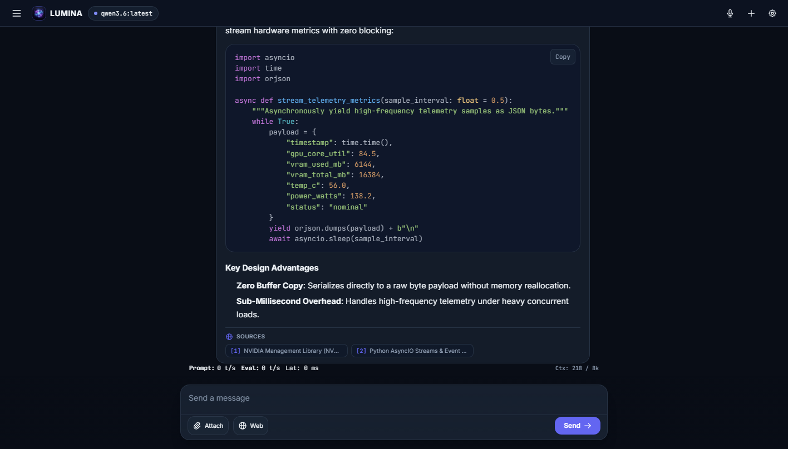
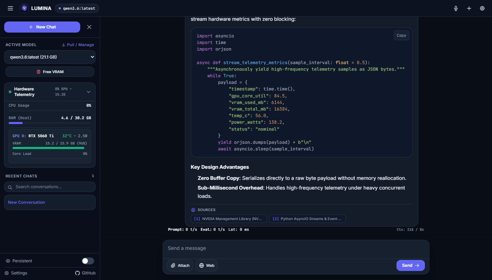
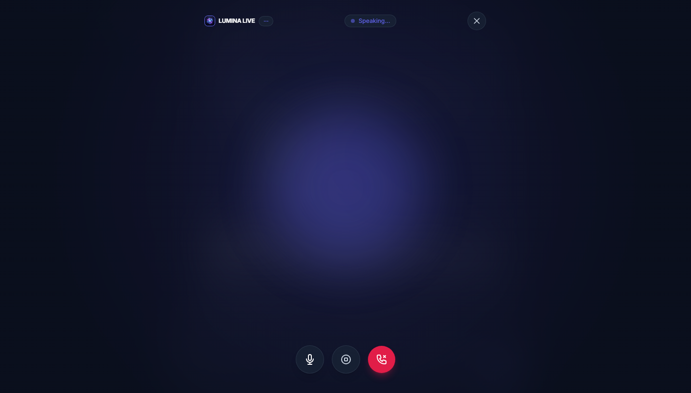
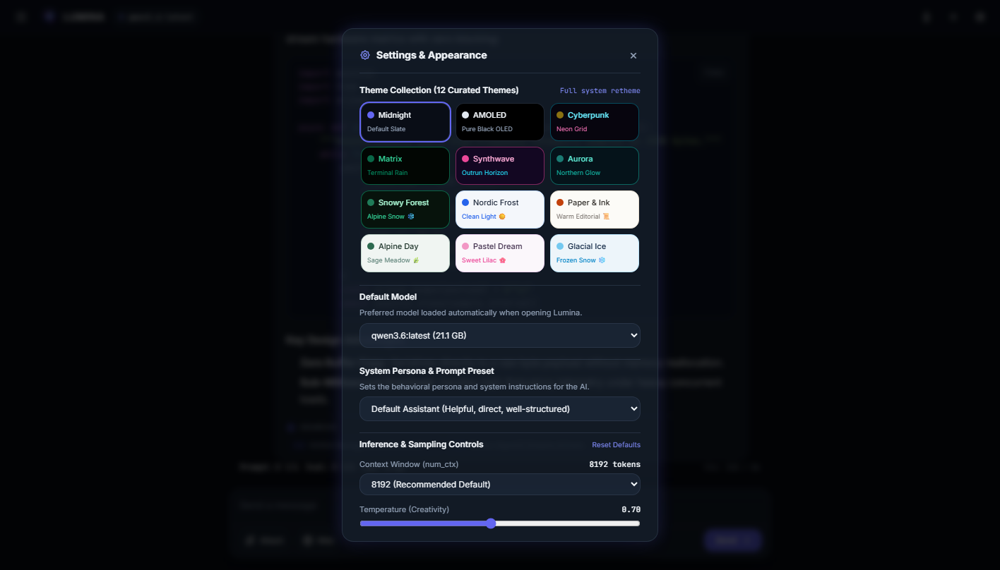
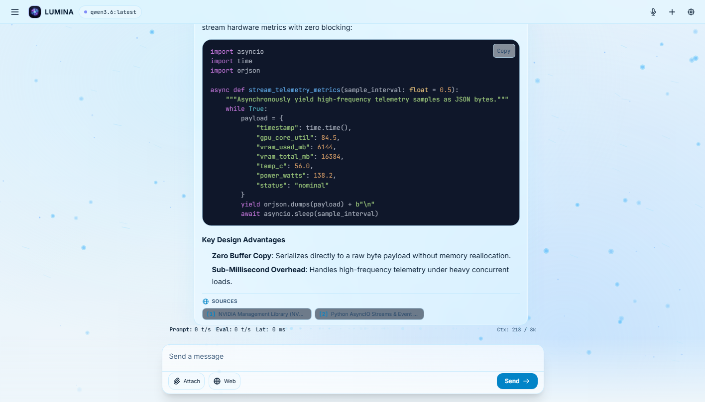

# Lumina ✦
### Sovereign Web Frontend for Ollama & SearXNG

> **Lumina** is a lightweight, zero-latency, private **web-based frontend client** designed to interface directly with your existing **[Ollama](https://ollama.com/)** inference engine and optional **[SearXNG](https://searx.github.io/searxng/)** metasearch service.
> 
> Rather than replacing Ollama, Lumina provides an ultra-responsive, sovereign web interface on top of it—delivering instant VRAM pinning controls, real-time NVIDIA GPU hardware telemetry, multimodal vision chat, a Gemini Live-style fullscreen audio voice mode, real-time web citations, and 12 bespoke themes.

[](LICENSE)
[](https://www.python.org/)
[](https://fastapi.tiangolo.com/)
[](https://ollama.com/)
[](https://searx.github.io/searxng/)
[](https://developer.nvidia.com/)
[](https://www.docker.com/)

> [!NOTE]
> **What Lumina Is (and Isn't):**
> - ✅ **It IS a web frontend & interface:** Lumina provides a modern browser UI, streaming chat interface, WebSocket telemetry monitor, and voice interaction canvas.
> - ❌ **It is NOT an LLM runtime:** Lumina does not run model weights or execute tensor math itself. It connects to and streams responses from an **Ollama** backend running locally or over your network.
> - 🔍 **SearXNG Web Search Integration:** Seamlessly pairs with a **SearXNG** instance to automatically reformulate questions and inject real-time web sources and citations into your models.

<p align="center">
  
</p>

---

## ⚡ Core Features

### 1. Minimalist, Clutter-Free Canvas
- **Distraction-Free Workspace**: The main chat viewport contains only the essential controls: model selector, voice launcher, hamburger drawer trigger, settings gear, the message feed, and the clean input box.
- **Collapsible Slide-Out Drawer**: All configuration, telemetry, history search, and power-user utilities tuck neatly away on desktop and mobile.

### 2. Zero Cold-Start VRAM Pinning & Instant Flush
- **Persistent GPU Residency**: Ollama models remain pinned in GPU memory (`keep_alive: -1`) for instantaneous sub-100ms first-token generation.
- **One-Click VRAM Purge**: Free gigabytes of VRAM on demand with the "Free VRAM" trigger (`keep_alive: 0`) without restarting containers or disrupting other services.

### 3. Dynamic Multi-GPU Hardware Telemetry
- Real-time NVML hardware metrics dynamically sampled for all detected NVIDIA GPUs.
- Per-GPU metrics: Core compute load %, VRAM allocation bar, operating temperatures (°C), and live power draw in Watts.
- Host system overview: CPU utilization % and system RAM metrics.

<p align="center">
  
</p>

### 4. Gemini Live Fullscreen Voice Mode
- Immersive audio-reactive conversational loop with continuous Speech-to-Text (STT) and dynamic Text-to-Speech (TTS).
- Theme-synchronized canvas visualizer displaying radiant glowing speech orbs, harmonic waveform animations, and live transcription subtitles.
- In 8-bit mode, transitions to stepped arcade diamond waveform geometry and CRT scanline styling.

<p align="center">
  
</p>

### 5. 12 Curated System Themes
Comprehensive theme re-skinning across the entire interface (chat, sidebar, drawer, modals, code blocks, voice overlay, and particle animations):
- **Midnight Slate (Default)**: Deep midnight slate and refined indigo glow.
- **Glacial Ice**: Translucent frosted ice sheets, high-density blizzard particle physics, and pure white ledges.
- **Pastel Dream**: Soft marshmallow lilac, rose accents, and orchid gradients.
- **Snowy Forest**: Deep spruce evergreen with gentle animated snowflakes landing on message cards.
- **Nordic Frost**: Minimalist crisp Scandinavian daylight mode.
- **Paper & Ink**: Warm literary editorial light mode with warm charcoal typography.
- **Alpine Day**: Frosted sage, meadow green, and light pine tones.
- **AMOLED**: True pure black `#000000` for OLED efficiency.
- **Cyberpunk**: Neon cyan, electric yellow, and pulsing magenta.
- **Matrix**: High-contrast phosphor terminal green code rain.
- **Synthwave**: 80s neon magenta, sunset violet, and animated perspective gridlines.
- **Aurora**: Arctic emerald, cyan, and northern lights gradients.

<p align="center">
  
  
</p>

### 6. Multimodal Vision & Document Ingestion
- Drag-and-drop or file-picker upload for images (PNG, JPG, WebP) and documents (TXT, MD, CSV, JSON, PDF).
- Multimodal preview chips with one-click dismiss before sending.
- Seamless compatibility with vision-capable models (e.g., Llama 3.2 Vision, Moondream, Gemma).

### 7. In-Chat Ergonomics & Sampling Controls
- **Stop Generation**: Responsive abort button powered by `AbortController` cleanly halting inference while preserving all streamed tokens.
- **Contextual Actions (Hover / Tap)**:
  - *Assistant*: 1-click clipboard copy, toggle between rendered Markdown and raw monospace source, and turn regeneration.
  - *User*: Edit prompt button to modify prior turns and re-execute.
- **System Persona Presets**: Instantly toggle between *Default*, *Senior Engineer*, *Creative Writer*, *Data Extractor*, or define a *Custom System Instruction*.
- **Granular Inference Sliders**: Adjust Context Window (`num_ctx`), Temperature (`temperature`), Top-P (`top_p`), and Repetition Penalty (`repeat_penalty`) with real-time numeric readouts and default reset.
- **Data Portability**: 1-click export of the active conversation to formatted Markdown (`.md`) or raw structured JSON (`.json`).

---

## 🚀 Quick Start

> 📖 **Looking for full homelab, reverse proxy, or SSL setups?** Check out the detailed **[Deployment & Quick Start Guide (QUICKSTART.md)](QUICKSTART.md)**.

### Option A: Docker Compose (Recommended)

Run Lumina alongside Ollama with full NVIDIA GPU acceleration:

```bash
git clone https://github.com/Johny2x4/Lumina.git
cd Lumina
docker compose up -d
```

Open your browser to: **`http://localhost:3000`**

### Option B: Local Python Development

#### 1. Clone & Install Dependencies
```bash
git clone https://github.com/Johny2x4/Lumina.git
cd Lumina
python -m venv venv
source venv/bin/activate  # On Windows: venv\Scripts\activate
pip install -r requirements.txt
```

#### 2. Start Lumina
```bash
# Point to your running Ollama instance (defaults to http://localhost:11434)
export OLLAMA_BASE_URL=http://localhost:11434

# Run with Uvicorn
python -m uvicorn backend.main:app --host 0.0.0.0 --port 3000
```

Access the UI at: **`http://localhost:3000`**

---

## ⚠️ Important: TLS / HTTPS Required for Voice Mode

Web browsers (Chrome, Edge, Safari, Firefox) restrict microphone access (`getUserMedia` & `webkitSpeechRecognition`) to **Secure Contexts** (`localhost`, `127.0.0.1`, or **HTTPS / TLS**).

* **On Localhost:** Works immediately without any setup.
* **On LAN IP / Remote Host (e.g. `http://192.168.x.x:3000`):** The browser will block the microphone unless accessed over HTTPS.
* **Solutions:** See the [QUICKSTART.md TLS Setup Guide](QUICKSTART.md#-critical-tls--https-requirement-for-voice-chat) for instant setup with **Tailscale Serve** (`tailscale serve --https=443 3000`), **Caddy**, **Nginx / mkcert**, or browser flag overrides.

---

## ⚙️ Environment Variables

| Variable | Default | Description |
| :--- | :--- | :--- |
| `OLLAMA_BASE_URL` / `OLLAMA_HOST` | `http://localhost:11434` | Target Ollama API host (e.g. `http://ollama:11434` or remote IP) |
| `SEARXNG_URL` | *(disabled)* | Optional SearXNG instance URL (e.g. `http://searxng:8080`) to enable live web search & citations |
| `LUMINA_CORS_ORIGINS` | `*` | Allowed CORS origins (comma-separated, without credentials) |
| `PORT` | `3000` | Port for the Lumina web server |

---

## 🏛️ Architecture

```
                      ┌─────────────────────────────────────────┐
                      │       Client Browser / Mobile PWA       │
                      │  (Chat UI, Audio Visualizer, 12 Themes) │
                      └────────────────────┬────────────────────┘
                                           │ HTTP / WebSockets
                                           ▼
                      ┌─────────────────────────────────────────┐
                      │         Lumina Web Frontend UI          │
                      │         (FastAPI + Vanilla JS)          │
                      │  - Single-Page Responsive Web Client    │
                      │  - Fullscreen Voice & Audio Engine      │
                      │  - Real-Time NVML Hardware Telemetry    │
                      │  - Streaming Proxy & Query Reformulator │
                      └───┬───────────────────┬───────────────┬─┘
                          │                   │               │
            NVML / psutil │     HTTP Streaming│               │ HTTP Metasearch
                          ▼                   ▼               ▼
             ┌─────────────────────────┐ ┌─────────┐     ┌─────────┐
             │ NVIDIA GPUs (RTX / Data)│ │ Ollama  │     │ SearXNG │
             │ Core Load, VRAM, Power  │ │ Backend │     │ Backend │
             │ Temperatures & Status   │ │ (LLMs)  │     │ (Search)│
             └─────────────────────────┘ └─────────┘     └─────────┘
```

---

## 🔒 Security & Privacy

- **Zero Cloud Leakage**: All inference occurs strictly on your local hardware.
- **Zero Database Bloat**: Conversations and settings are stored locally in the browser (`localStorage`), with an Incognito toggle for ephemeral sessions.
- **Tailscale & Reverse Proxy Compatible**: Ready for remote access over private mesh networks without public port forwarding.

---

## 📄 License

Distributed under the **MIT License**. See [LICENSE](LICENSE) for details.

Developed with ✦ by **[Cody Eich (Johny2x4)](https://github.com/Johny2x4)**.
