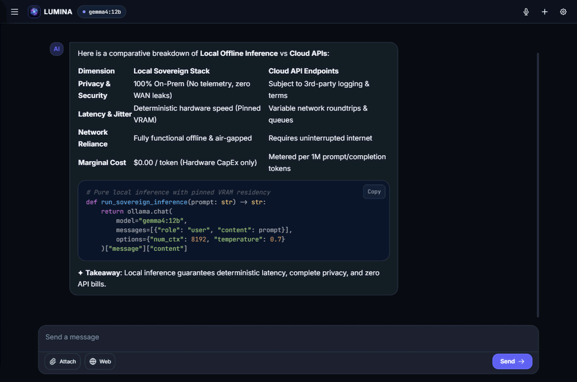
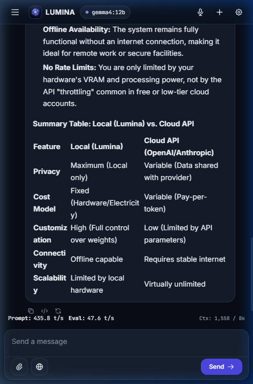
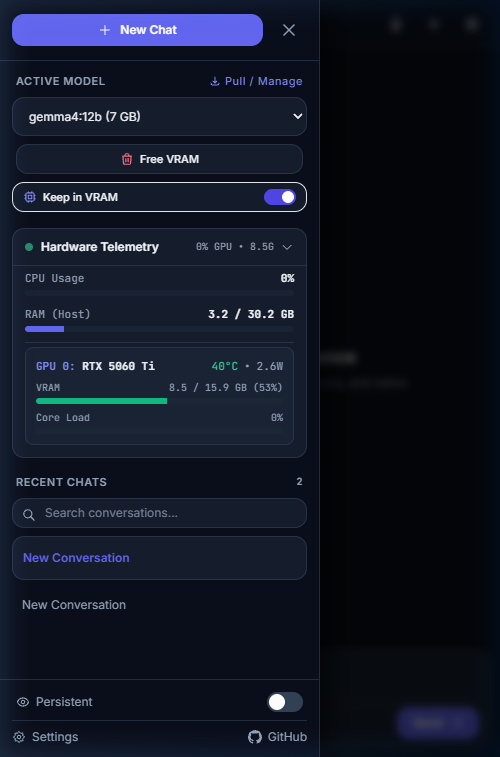
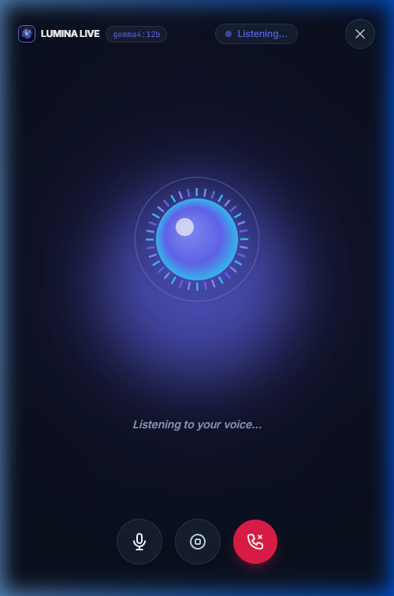
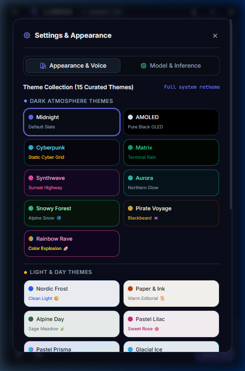

# Lumina ✦
### Sovereign Web Frontend for Ollama with Optional Extensions

> **Lumina** is an ultra-low overhead, purely self-hosted **web frontend for [Ollama](https://ollama.com/)**.
> 
> Built specifically for **conversational, turn-based chat (not complex agentic loops)**, Lumina prioritizes lightning-fast responsiveness, zero cloud dependencies, and a clean, distraction-free canvas, while also featuring **Lumina Live**—an immersive real-time voice mode inspired by Gemini Live.
> 
> Deploy it standalone on top of your existing Ollama instance, or seamlessly power it up with optional homelab extensions: real-time web search (**[SearXNG](https://searx.github.io/searxng/)**), local neural voice (**[Kokoro TTS](https://github.com/remsky/Kokoro-FastAPI)**), and secure gateway routing (**[Nginx](https://nginx.org/)**).

[](LICENSE)
[](https://www.python.org/)
[](https://fastapi.tiangolo.com/)
[](https://ollama.com/)
[](https://searx.github.io/searxng/)
[](https://github.com/remsky/Kokoro-FastAPI)
[](https://developer.nvidia.com/)
[](https://www.docker.com/)

> [!NOTE]
> **What Lumina Is (and Isn't):**
> - ✅ **A Dedicated Web Interface:** Modern streaming chat canvas, direct model management, multi-GPU telemetry dashboard, and live voice canvas.
> - 🎯 **Turn-Based Conversational Chat:** Focused on direct, high-speed human-to-LLM conversation. Lumina does not run multi-agent execution graphs, automated tool-calling loops, or heavy enterprise vector databases.
> - ❌ **Not an LLM Runtime:** Lumina does not execute tensor math or model weights directly; it connects to and orchestrates your local **Ollama** engine.
> - 🧩 **Modular & Standalone:** Lumina functions standalone with just Ollama. Extensions like SearXNG, Kokoro TTS, and Nginx are 100% optional.

---

## ⚡ Core Features & Showcase

### 1. Conversational, Turn-Based Chat Canvas
Lumina is engineered around a clean, distraction-free conversational viewport:
- **Streaming Token Inference**: Low-latency token-by-token rendering with throttled DOM parsing to eliminate interface jank.
- **Rich Document & Vision Attachments**: For supported models, drag-and-drop or upload images (PNG, JPG, WebP) and documents (TXT, MD, CSV, JSON, PDF, code files) with preview chips.
- **Markdown, Syntax Highlighting & Math**: Render syntax-highlighted code blocks with 1-click clipboard copy, alongside native KaTeX math and chemical formulas.
- **In-Chat Controls**: Abort running generation instantly via `AbortController` (preserving partial responses in history), edit and resubmit prior user turns, toggle raw monospace source, or adjust sampling options (temperature, top_p, repetition penalty).

<p align="center">
  
</p>

---

### 2. Model Selection, Management & Multi-GPU Telemetry
Manage your local AI engine directly through the slide-out drawer without opening a terminal:
- **Sidebar Model Selector**: Switch active models instantly from the slide-out sidebar or top navigation bar.
- **In-App Model Pulls & Deletions**: Pull models directly from Ollama's registry or any Hugging Face GGUF repository (`hf.co/...`), or delete unused models to reclaim disk space.
- **Model Prewarming & Persistence ("Keep in VRAM")**: Models automatically load into VRAM and stay pinned in GPU memory (`keep_alive: -1`) to eliminate cold-start warmup latency on subsequent turns.
- **One-Click VRAM Flush ("Free VRAM")**: Instantly evict the active model from GPU memory (`keep_alive: 0`) when you need to reclaim VRAM for gaming, ComfyUI, or other tasks.
- **Live Multi-GPU NVML Telemetry**: Real-time hardware stats sampled dynamically over WebSockets—per-GPU core compute load %, active VRAM allocation bar, operating temperatures (°C), and live wattage draw, alongside host CPU and RAM utilization.

<p align="center">
  
</p>

---

### 3. 15 Bespoke Visual Themes
Lumina features 15 hand-crafted system themes spanning atmospheric dark aesthetics and crisp daylight palettes. Watch the chat window transition across themes below:

<p align="center">
  
</p>

- **Dark Atmosphere (9 Themes)**:
  - **Midnight (Default)**: Deep midnight slate with refined indigo ambient glow.
  - **AMOLED**: True pure black `#000000` for OLED power efficiency and maximum contrast.
  - **Cyberpunk**: Neon cyan, electric yellow, and pulsing magenta gridlines.
  - **Matrix**: Phosphor terminal green code rain aesthetic.
  - **Synthwave**: 80s neon magenta, sunset violet, and animated perspective grid.
  - **Aurora**: Arctic emerald, cyan, and northern lights gradients.
  - **Snowy Forest**: Deep spruce evergreen with gentle animated snowflakes.
  - **Pirate Voyage**: Weathered parchment, warm bronze, and sea-captain charcoal.
  - **Rainbow Rave**: Chromatic reactive gradients and pulsing spectrum glow.
- **Light & Day (6 Themes)**:
  - **Nordic Frost**: Minimalist crisp Scandinavian daylight mode.
  - **Paper & Ink**: Warm literary editorial light mode with charcoal typography.
  - **Alpine Day**: Frosted sage, meadow green, and light pine tones.
  - **Pastel Lilac**: Sweet marshmallow lilac with high-contrast violet user cards.
  - **Pastel Prisma**: Saturated chromatic pastel wash with playful accents.
  - **Glacial Ice**: Translucent frosted ice crystal sheets with blizzard particle physics.

---

### 4. Responsive Desktop & Mobile PWA Design
Lumina was designed from the ground up for mobile and Progressive Web App (PWA) ergonomics:

<p align="center">
  
  
  
  
</p>

- **Mobile Slide-Out Drawer**: All telemetry, model selection, memory toggles, and chat histories tuck neatly into an overlay drawer that sweeps out of sight during conversation.
- **PWA Ready**: Installable directly to your home screen on iOS and Android with offline asset caching and touch ergonomics.

---

### 5. Lumina Live: Fullscreen Voice Mode (Inspired by Gemini Live)
- **Continuous Conversational Loop**: Hands-free voice chat powered by your browser's Web Speech STT and a local Kokoro neural TTS backend.
- **Reactive Canvas Visualizer**: Radiant glowing audio spheres and dynamic harmonic waveforms that morph and pulse in real time to speech frequencies.
- **Retro 8-Bit Scanline Mode**: In arcade themes, transforms the audio orb into stepped diamond geometry with CRT phosphor scanlines.

<p align="center">
  
</p>

> [!WARNING]
> **Important: TLS / HTTPS Required for Voice Mode over LAN & Mobile**
> Modern web browsers (iOS Safari, Android Chrome, and remote desktop browsers) strictly require a **Secure Context (`localhost`, `127.0.0.1`, or HTTPS / TLS)** to grant microphone access (`getUserMedia`).
> If accessing Lumina over your home LAN (`http://192.168.x.x:3000`), the browser will **block the microphone**.
> To enable voice mode across your network, connect via **Tailscale with MagicDNS/HTTPS** or deploy the bundled Nginx TLS Gateway.
> See the [Getting Started Guide: TLS & Voice Requirements](docs/GETTING_STARTED.md#tls--https-voice-chat-requirements) for complete setup instructions.

---

### 6. Modular Extensions (Optional Power-Ups)
Lumina is architected so that each companion service is **strictly optional**. If an extension is omitted, Lumina still works seamlessly, simply adapting its feature set:

| Component | Status | Role | What Happens If Omitted? |
| :--- | :--- | :--- | :--- |
| **Ollama** | **Required** | Local LLM runtime (GGUF, GPU acceleration, streaming) | Core requirement. Lumina needs Ollama to generate chat responses. |
| **SearXNG** | **Optional** | Private real-time metasearch & citations | Lumina functions 100% as an offline local chat client. The web search toggle is simply disabled. |
| **Kokoro TTS** | **Optional** | 82M neural voice synthesis for speech output | Lumina Live voice mode remains fully functional, falling back to your browser's native Web Speech synthesis. |
| **Nginx Gateway** | **Optional** | Unified single-port routing & TLS certificate termination | Lumina runs directly on port 3000 over plain HTTP (suitable for localhost or behind Tailscale / Caddy). |

---

## 🔒 Privacy & Sovereign Architecture

- **100% Self-Hosted & Local**: All frontend vendor assets (Tailwind CSS, DOMPurify, KaTeX math engine, 20 WOFF2 fonts, Marked.js, Highlight.js) are completely self-hosted locally within the container. Zero requests escape to external CDNs or analytics trackers.
- **High-Capacity Client Storage (IndexedDB)**: Conversations, images, and long contexts are persisted client-side in the browser via **IndexedDB** (`luminaStorage`), eliminating the traditional 5MB `localStorage` quota limit.
- **Instant Client Preferences (localStorage)**: UI configurations (active theme, system persona, inference options, auth token) are stored in `localStorage` for instant hydration without backend database overhead.
- **Incognito Mode**: Toggle Incognito at any time to enter 100% ephemeral in-memory sessions that leave zero trace in browser storage upon closing.

---

## 🚀 Quick Start

The default `docker-compose.yml` launches the **Workstation Stack with Neural Voice** (Lumina UI + Ollama + Kokoro TTS) out of the box:

* ✅ **Lumina UI**: Sovereign web interface on `http://localhost:3000`.
* ✅ **Ollama**: Local GPU-accelerated LLM inference engine.
* ✅ **Kokoro TTS**: Local neural voice backend for Lumina Live voice mode.
* ❌ **Omitted from Quick Start:** **SearXNG** (real-time web search) and **Nginx** (TLS reverse proxy) are omitted to keep the initial startup lean.

```bash
# 1. Clone the repository
git clone https://github.com/Johny2x4/Lumina.git
cd Lumina

# 2. Launch Lumina + Ollama + Kokoro
docker compose up -d
```

Open your browser to: **`http://localhost:3000`**

> [!TIP]
> **Looking for a different flavor?**
> - **Just Lumina UI (on top of your existing Ollama/services):** See [Variant 1](docs/GETTING_STARTED.md#variant-1-lumina-on-top-of-existing-services).
> - **Minimalist Workstation (Lumina + Ollama only, without Kokoro):** See [Variant 2](docs/GETTING_STARTED.md#variant-2-lumina--ollama-workstation-stack).
> - **Full Homelab Cockpit (with SearXNG Web Search & Nginx TLS Gateway):** See [Variant 3](docs/GETTING_STARTED.md#variant-3-full-sovereign-homelab-stack).

---

## 📖 Comprehensive Deployment Guide

For customized setups, network exposure, and multi-service homelab configurations, see our **[Getting Started & Deployment Guide](docs/GETTING_STARTED.md)**:

* 📦 **[Variant 1: Lumina on Top of Existing Services](docs/GETTING_STARTED.md#variant-1-lumina-on-top-of-existing-services)** — Connect Lumina to an Ollama, SearXNG, or Kokoro instance already running on your network.
* 💻 **[Variant 2: Lumina + Ollama Workstation](docs/GETTING_STARTED.md#variant-2-lumina--ollama-workstation-stack)** — Turnkey single-machine setup with GPU acceleration (no SearXNG, Kokoro, or Nginx).
* 🏰 **[Variant 3: Full Sovereign Homelab Stack](docs/GETTING_STARTED.md#variant-3-full-sovereign-homelab-stack)** — All-in-one private AI cockpit with Lumina, Ollama, Kokoro TTS, SearXNG, and Nginx with TLS.
* 🌐 **[Network Exposure & LAN / Tailscale Binding](docs/GETTING_STARTED.md#network-exposure-lan--tailscale-access)** — Instructions on changing binding from `127.0.0.1:3000` to `0.0.0.0:3000`.
* 🔑 **[Authentication Tokens (`LUMINA_AUTH_TOKEN`)](docs/GETTING_STARTED.md#enabling-authentication-lumina_auth_token)** — Secure your instance across shared networks.
* ⚙️ **[Model Management Guide](docs/GETTING_STARTED.md#model-management-guide)** — Pulling, activating, deleting, prewarming, and VRAM persistence.

---

## 📄 License

Distributed under the **MIT License**. See [LICENSE](LICENSE) for details.

Developed with ✦ by **[Johny2x4](https://github.com/Johny2x4)**.
